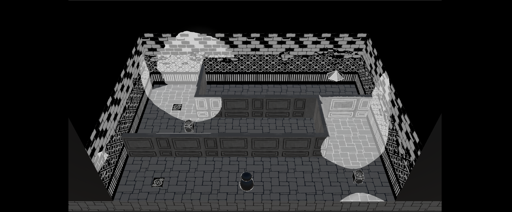
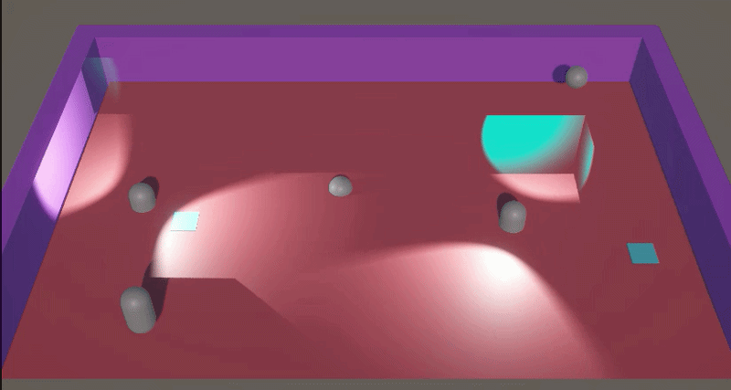
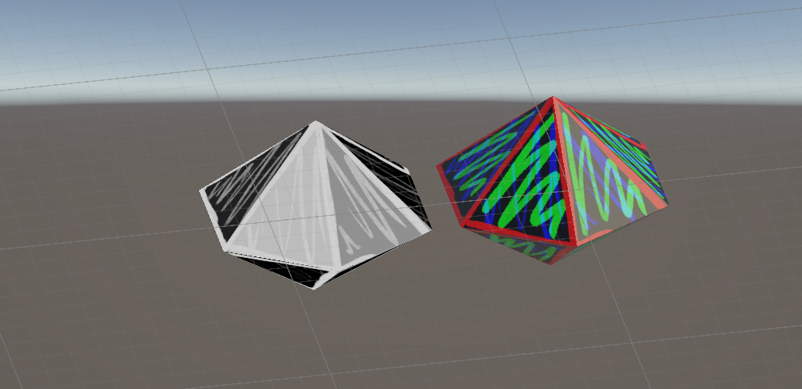

+++
date = '2026-02-24T20:38:22+09:00'
draft = false
title = 'Not My Beautiful House'
subtitle = 'A spooky little game jam game'
featured_image = 'title.png'
tags = ["game jam"]
+++



This little puzzle game was made for the Brackeys 2026 Jam, with the theme of Strange Places. Lights will shine the way you can go around this strange house.

My initial idea revolved around a lighting based mechanic I'd thought of, where coloured lights could be used to shine on different areas, and affect what you can see, in the post processing. I wanted something looking like the Luigi Mansion mini game for the wii-u, where you could walk around with a torch and things appear in the torch light, but in the style of an Edward Gorey book.

Well this turned out to be quite difficult.

The jam was a week, and I think I spent half of that trying to make the effect work. I used red lights to shine on areas of the scene, then grabbed a blit pass of the view and passed that into a shader in order to show and hide certain areas based on their red value. You can see this kind of working in the gif below.

But, this came with a couple of issues. You'll see the light-beam of the torch still visible behind the wall. The lights were on one layer, and the walls made visible by the post-processing had to be on their own layer, in a particular order.

The tops of the walls were not visible. This made the walls just look odd. And from the side or the back, how should they look?

Other problem was that I had decided on my artstyle, and filled a Pinterest board with Edward Gorey, Tim Burton and some other sketchy looking spookies. And when I now wanted to apply a wibbly edge to my shadows, everything rendered in screen space, when I wanted it in object space. I think that if I had gone for a more basic artstyle, maybe something top down with pixel art and a limited colour palette it would have all worked. So I will have to file this idea away for the future.

But enough about what didn't work... I decided instead to use a shader that took the lighting data, as shone onto each object, and used that to create interesting shadows. Each object in the scene has a texture with information in each RGB channel, so that the greys can be changed independently. So on the walls, the bricks are always the same grey and the grout changes when the light hits it. 

And everything uses a global variable of "offset" that moves the whole texture between 0 and 0.5 every 0.3 seconds, giving it all a little shaky feeling. The gemstones have their own shader which fakes the light and uses a texture to give a fake shine. You can see the gemstone with the shader and without it below.

Instead of having walls appear in the torchlight, I used [this tutorial](https://www.youtube.com/watch?v=2Q5n7KFsr3s) to create torch cones to make wall appear or vanish. I tried to do something clever with lights hitting walls to make them solid or not. But really it was easier to use raycasts.

I really liked the lighting effect in the end. It's very different to other things I've made and it was really fun experimenting with it. It didn't do terribly well in the game jam, but I find with huge jams like this (which crash the itch.io servers) it can be hard to stand out, and I don't want to stress too much about making something really polished, I would much rather try something new and have a play. And that's always been my thoughts on game jams, it's nice when they turn out well and I make an actual game. But as long as I've had fun and learnt something new, then it's been a success to me.



If find myself with some more time to spend on this, I do have some updates I would make. I wanted to have some hidden spooky things in the walls. Using decals or something with the lighting shader on them I would add creepy eyes or faces in the walls. And spooky windows. And add some scene transitions and a menu, and maybe audio. I think the game was marked down for lack of audio and it would nice to give it that extra bit of polish.
