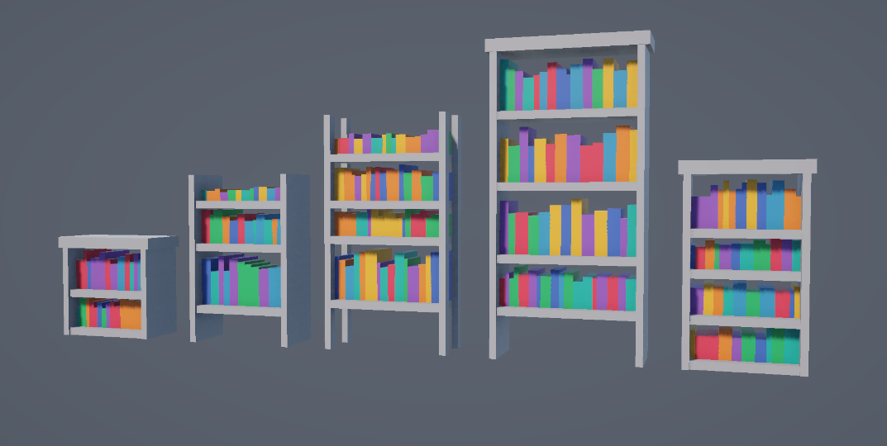
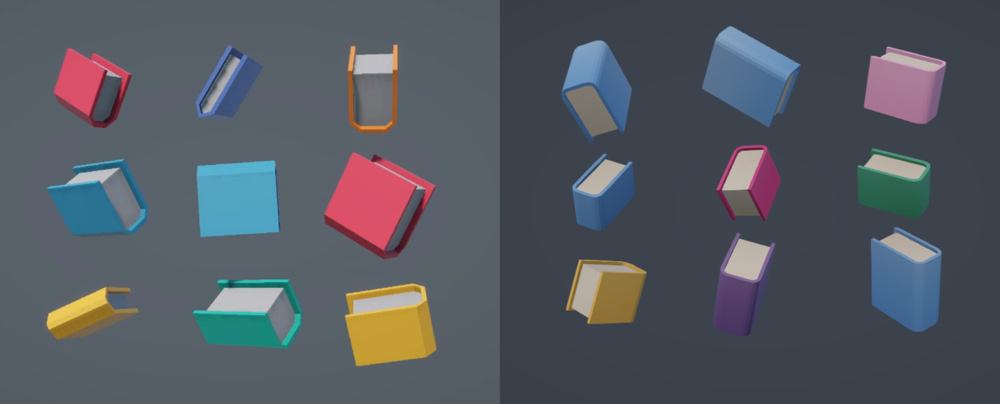

+++
date = '2026-03-26T20:38:22+09:00'
draft = false
title = 'Procedually Generated Bookcases'
subtitle = 'A little experiment with procedually generated meshes'
featured_image = 'bookcases.png'
tags = ["procedual generation"]
+++



[View on itch.io <i class="aboutIcons fa-brands fa-itch-io fa-sm"></i>](https://alittleredpanda.itch.io/procedually-generated-bookcase)



I have a constant battle with myself over properly learning to 3D model. It's so much easier to just model with code, right? RIGHT?

My latest journey into procedural generation came in the form of little bookcases. I haven't made anything like this for a while, and have ideas for a future Big Proc Gen project, so I wanted some practice, something that would only take me a few weeks to create.

I began by getting the basic shapes in, the shelves the very cube like books. The shelf generation step works out how many shelves we want, how wide they should be. And the type of shelf, whether it has sides or just corners. If it has a top etc.

The books did just have one diagonal to show depth, but that was too chunky. I briefly discovered a shape called the "squircle" and was going to make the book spines into squircles, but that's a bit more complex than I wanted. In the end, the edges of the spines are quarter circles, so I can control their smoothness. I think they have four faces each.

I had a list of ideas of things to put on the shelves, but settled on just photo frames. They share their colour palette with the books. And the images are just generated noise from shader graph.

Once the books have been placed, an invisible box is placed on the shelf, and any books colliding with it are destroyed. The frame then appears in its place. It's probably not the most elegant way of placing the frames, but it works. I made the frame as a "ThingsOnShelves" class, so that if I want to add more items I can, I just need to code their models.

Finally the bunting. It's just a LineRender on a Bezier curve between the shelf sides. And little flags spawn along it. 



All along the way, I was changing values, making everything a bit chunkier etc. That's why I think it's important to just get the basic shapes first. As you add more, you see the kind of feel you want your model to have. Saying that, I do still sketch everything out, because when each vertex has to be manually placed, you need to consider the exact co-ordinates.

The actual process of procedurally generating meshes is a difficult one. And I learnt about it quite a while ago from the following tutorials

- [Cat Like Coding series on Procedual Meshes](https://catlikecoding.com/unity/tutorials/procedural-meshes/)
- [3D Procedual Mesh Generation, by my good friend Oliver Carson](https://www.udemy.com/course/unity_procgen/) 
- And [The Procedural Landmass Generation series by Sebastian Lague](https://www.youtube.com/watch?v=wbpMiKiSKm8&list=PLFt_AvWsXl0eBW2EiBtl_sxmDtSgZBxB3)

Obviously I know this is not the most optimal way to create bookcases with random books and items, but it's always a fun challenge to make something like this.