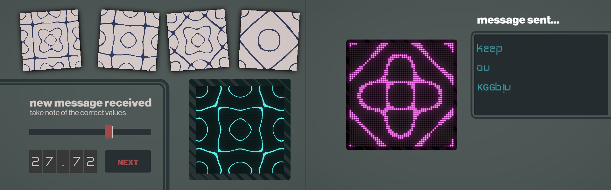
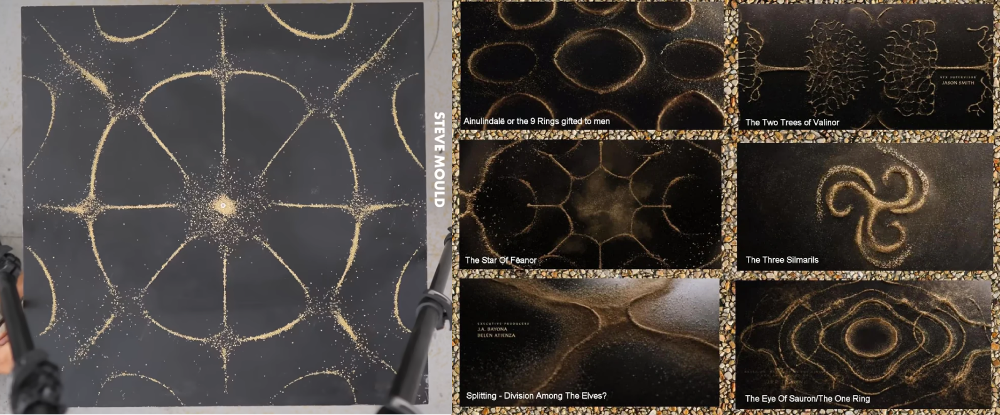
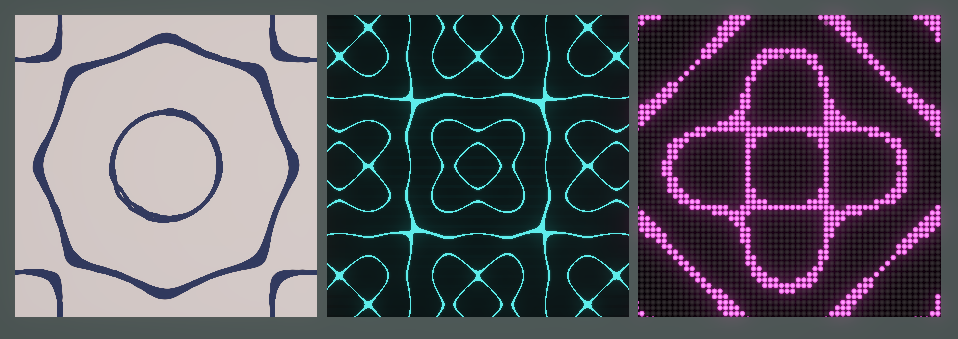
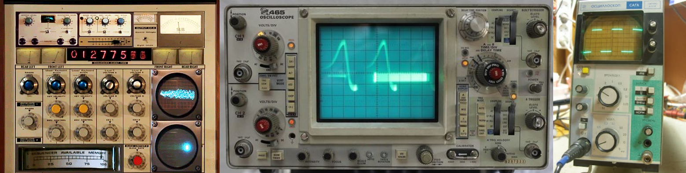

+++
date = '2026-04-28T20:38:22+09:00'
draft = false
title = 'Signal Manager'
subtitle = 'A mini-game made for Ludum Dare 59: Signals'
featured_image = 'QrADt1.png'
tags = ["game jam"]

+++



This jam began after the latest episode of Task Master, in which contestants had interpret notes played on a bagpipe and decipher which word was being spelled out. So that was my original idea, information is passed to the player in one form which they have to repackage in some way and then send on.

But how to do this? Initially I thought soundwaves, encourage the player to read waves and work out a message. When doing some research on Saturday morning, I came across the Chladni figures, as used in the Rings of Power Intro Sequence, where vibrations on sand covered metal plates form patterns as sand clusters in areas between vibrations. In his video recreating the Rings of Power intro, Steve Mould shared the equations which form these patterns. 

I thought this was ideal, I could use these to place particle systems, but as I have to use the old particle system (because I wanted to create a web build) it proved to be too difficult to place the particles using that particular kind of equation. And I'm not good enough at maths to work out *how* to do it, because I'm still sure it's possible.

Anyway, I *could* put the equation into Shadergraph to show the equation, and could add a couple of variables to change the pattern. So that became the basis of my game. I could show the figure in three different styles, for three sections of the game. A slightly wibbly light drawn version, which is handed to the player at the start, a oscilloscope style is shown when the player tries to find the correct values. Finally we have some pixelated lightbulbs to display the message at the end, where the final message is written out in English, if the accuracy is high enough. Otherwise, who knows what you might end up saying?

With the oscilloscope shader and slightly retro-futuristic messaging system, I wanted a bit of cassette futurism style, which is a more brutalist kind of eighties style, with grey green monochrome colour scheme, and interactive elements highlighted in red.

If I were to do an update to this, I would like to add:

-  Additional difficulty level, with two dimensions of values on each signal

- Maybe some story threads through the messages sent

- Graphics update - lean more into the cassette futurism with a blocky print style often used in that time

- I would like to try and replicate the effect with VFX Graph, which offers a lot more options than Unity's old particle system. Maybe I would have more luck with that 