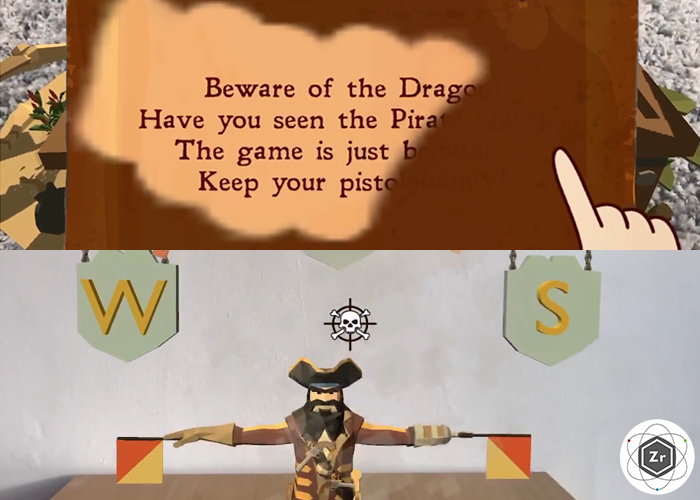
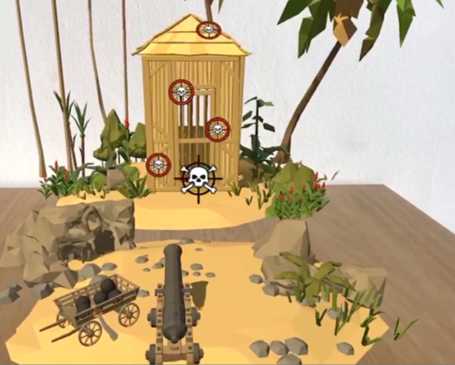
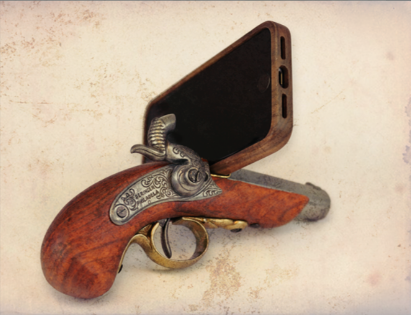

+++
date = '2019-07-26T20:38:22+09:00'
draft = false
title = 'Pirate Mini Games'
company = 'Created while working at Zubr'
subtitle = 'AR Mobile App'
technology = 'Made in Unity, with AR Kit'
bgColour = '#B37A23'
textColour = '#2d3436'

+++


We were comissioned to make a series of pirate themed mini games for an adventure holiday company.

With another programmer, I helped design several little games that used a shooting mechanic inlcuding a semaphore puzzle, steady wire game and another where a water pistol cleaned off a dirty map. We had a special phone holder created with a prop pistol, so that the players were physically holding a little gun when shooting in game.

As well as programming and game design for this project, I created small visual effects and shaders that worked within the interactions.

















