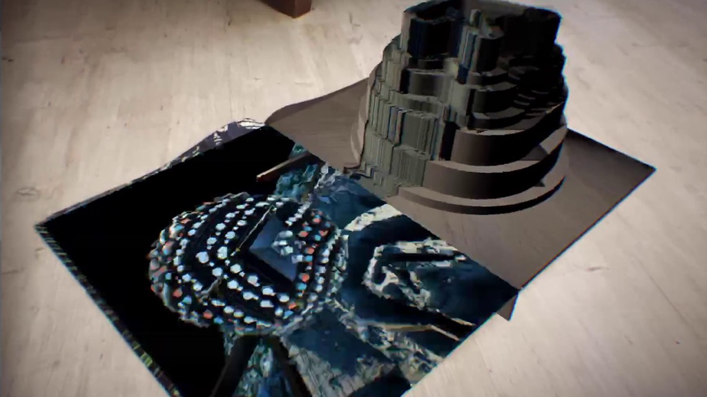

+++
date = '2018-11-26T20:38:22+09:00'
draft = false
title = 'Crack Magazine x Aphex Twin'
company = 'Created for Crack Magazine while working at Zubr'
subtitle = 'AR Experience'
technology = 'Made in Unity, with AR Kit, and Facebook Filter created in Spark AR'
bgColour = '#00b894'
textColour = '#2d3436'

+++



To mark a exclusive interview between Crack Magazine and electronic music artist Aphex Twin, we made an app to bring his weird, unique visual style to life.

Across the ten page spread, art work created by Aphex Twin's visual partner Weird Core, could be scanned and distort and warp.

As well as working on shaders for this app, I also created a Facebook Filter to compliment the app.

[View the project on Zubr.co](https://zubr.co/case-study/aphex-twin-ar-experience/)













<!-->









<!-->







