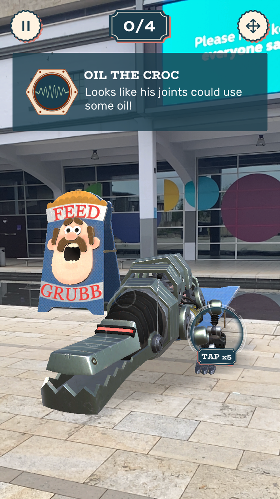
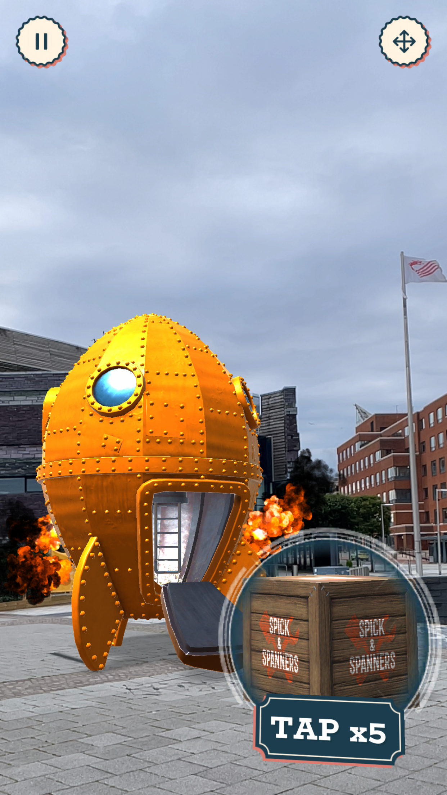

+++
date = '2021-08-26T20:38:22+09:00'
draft = false
title = 'Fix Up the City'
company = 'Created in collaboration with Aardman while working at Fictioneers'
subtitle = 'Location Based AR App'
technology = 'Made in Unity, with AR Foundation'
bgColour = '#1A3B5A'
textColour = '#faf5e3'

+++


 The location based sequel to The Big Fix Up. This app uses LiDAR scanned areas of Bristol, Cardiff and San Francisco to trigger scenes to appear, which interact and bounce off objects and buildings in the real world.

I worked on this project from the start, and so had a much bigger role in the development of the minigames and design of the overall app.

As part of the Unity team, I worked on the AR scenes, implementing models and animations, using Unity's Timeline Package to compose scenes and sequences.

I also worked on the VFX of this game, creating shaders, particle systems and other effects to enhance the the look and feel of the app 




















