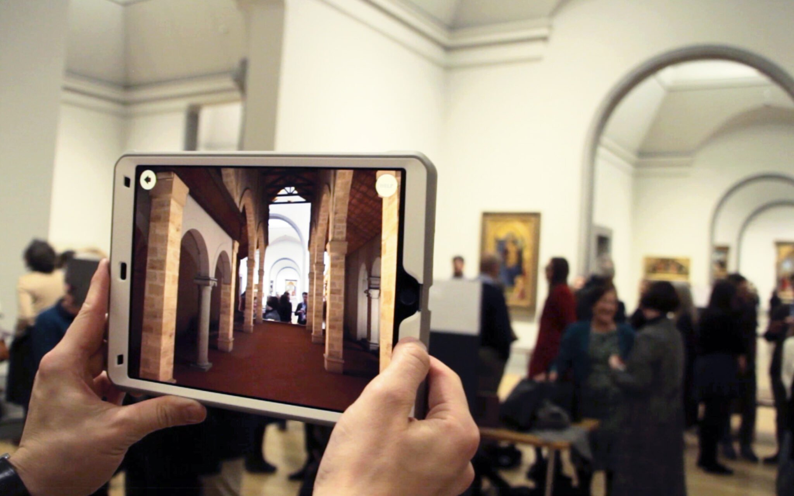
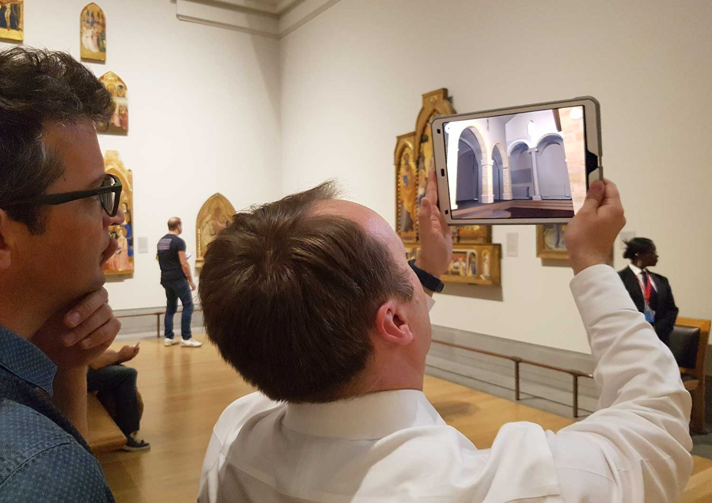

+++
date = '2019-11-26T20:38:22+09:00'
draft = false
title = 'Hidden Florence 3D'
company = 'Created for the National Gallery, London, while working at Zubr'
subtitle = 'Location Based AR App'
technology = 'Made in Unity, with AR Kit'
bgColour = '#fbf8e5'
textColour = '#211d1e'

+++



As part of an ongoing research project into the San Pier Maggiore church, which once stood in Florence, we created an app based around the alterpiece, now hanging in the National Gallery. 

When looking at Jacopo di Cione's painting, the app would take the user back in time, to see the church how it would have been, with the alterpiece hanging in place.

I was the sole programmer on this project, which utilises AR Kit's image recognition. And I created a shader to fade the church into view over the camera feed.

[View the project on Zubr.co](https://zubr.co/case-study/hidden-florence-3d/)
















