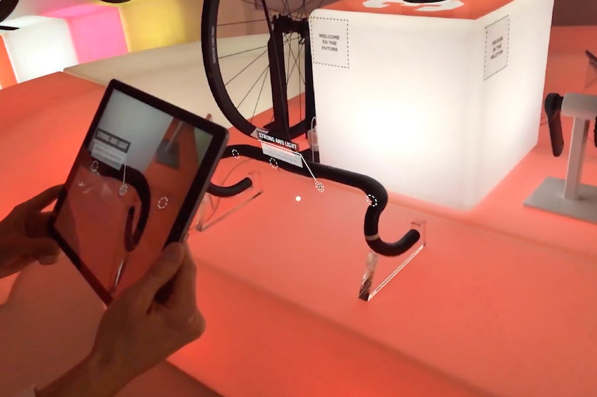

+++
date = '2018-10-26T20:38:22+09:00'
draft = false
title = 'Saddleback at Rouleur Classic'
company = 'Created for Saddleback while working at Zubr'
subtitle = 'AR Experience'
technology = 'Made in Unity, with AR Kit'
header_image = '/images/sbr.jpg'
bgColour = '#5880E2'
textColour = '#2d3436'

+++



We worked with luxury cycling supplier Saddleback, using AR to showcase some of their newest tyres and accessories at the Rouleur expo in London.

The app could view the products on display and show information labels around them. 

At the back of the room we created AR windows to show a glimpse into the Saddleback workshops. Moving backwards and forwards would transition between different 180 degree videos.

On this project, I was the lead programmer. I also designed and created the window video experiences, I made the animated UI around the cycling paraphnalia. And I made shaders to add an extra layer to the experience.

[View the project on Zubr.co](https://zubr.co/case-study/saddleback-rouleur-live/)




















