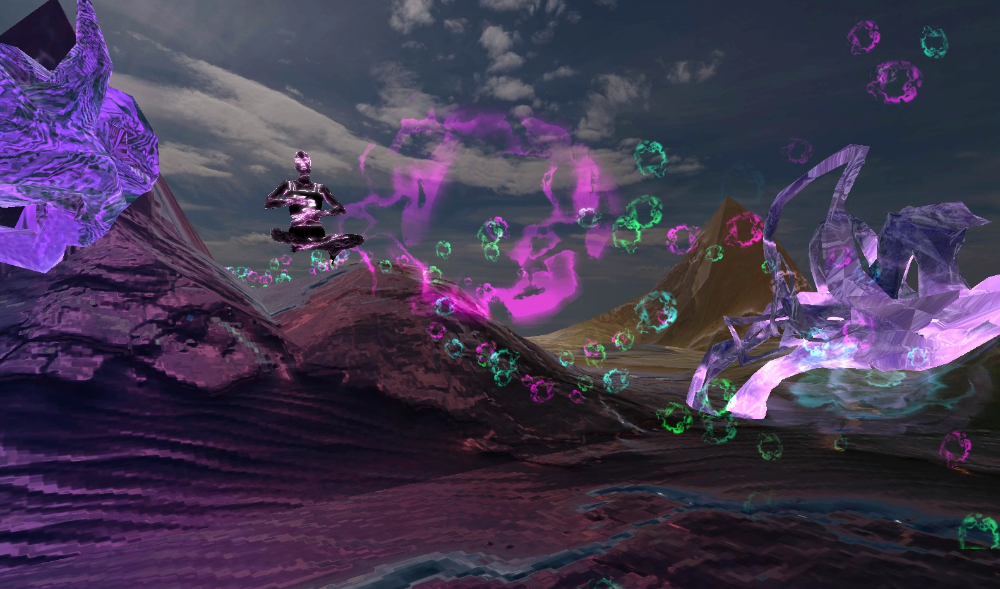
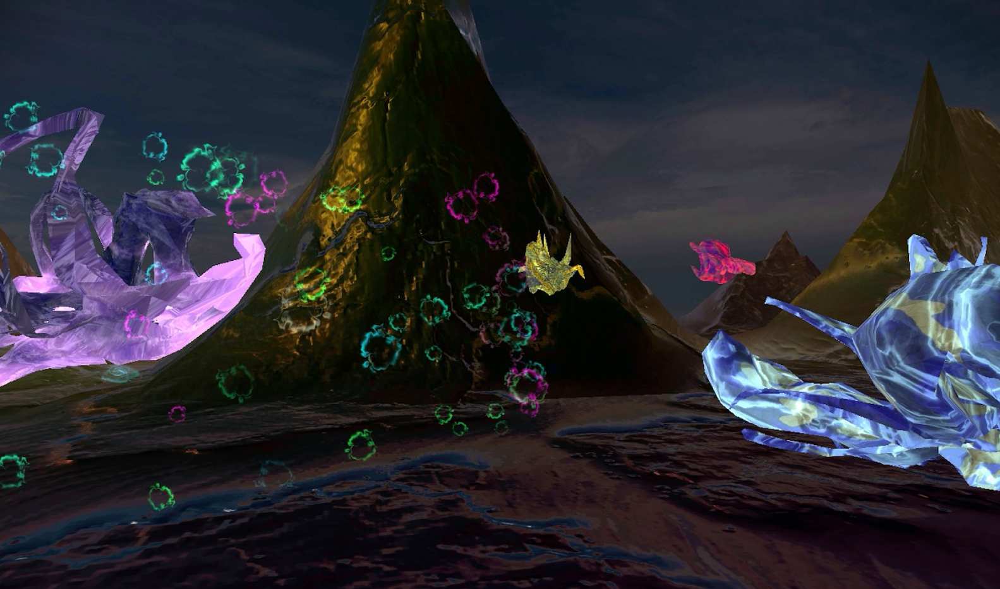
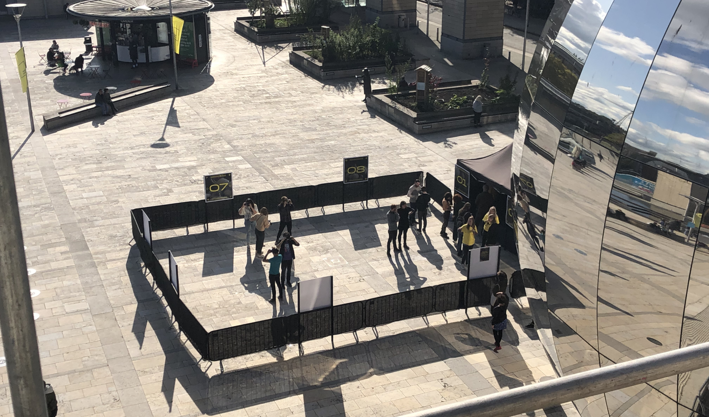
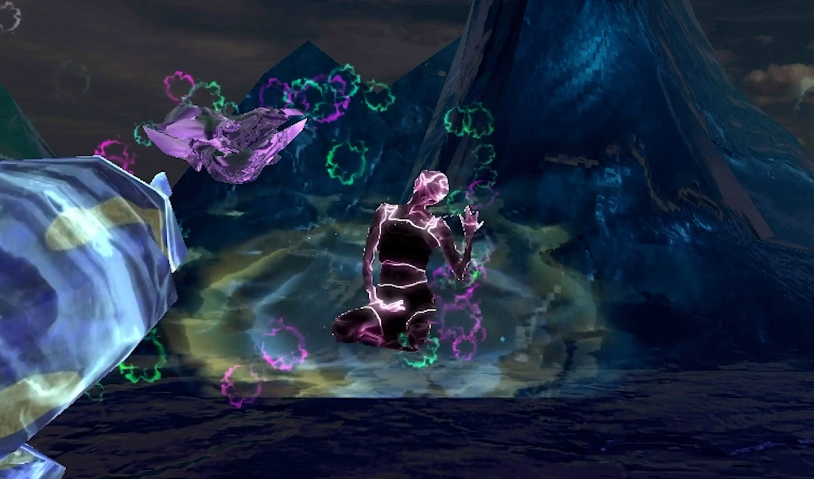

+++
date = '2019-10-26T20:38:22+09:00'
draft = false
title = 'Aisha Devi Music Video'
company = 'Created for the Simple Things Festival, while working at Zubr'
subtitle = 'Mixed Reality Experience'
technology = 'Made in Unity, with AR Foundation'
bgColour = '#66587a'
textColour = '#2d3436'

+++


As part of the Simple Things Festival, we developed a VR music for electronic artist A&#239;sha Devi and her track "I'm Not Always Where My Body Is"

We placed a 3D scan of A&#239;sha within a surreal, otherworldly landscape, and played different stems of the track around the space. Users could wander around, watching A&#239;sha move and seeing particle systems react to the different sounds.

This was a fun and interesting project to work on, working out how to create particle systems that would grow and change based on the volume of the different stems. And working with volumetric shaders to take the 3D scan of A&#239;sha and make her look awesome.

It was also challenging, as we were using GearVR headsets for the VR landscape, which utilised the camera and AR function to keep the users in the correct place based on tracking images around the area.

[View the project on Zubr.co](https://zubr.co/case-study/aisha-devi-vr-performance/)





















