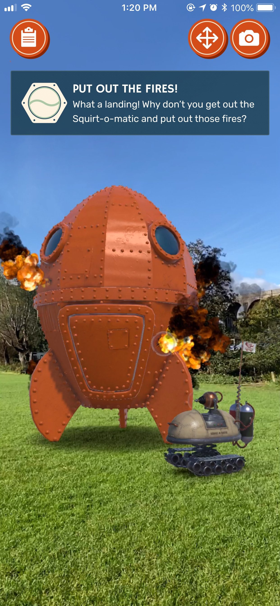
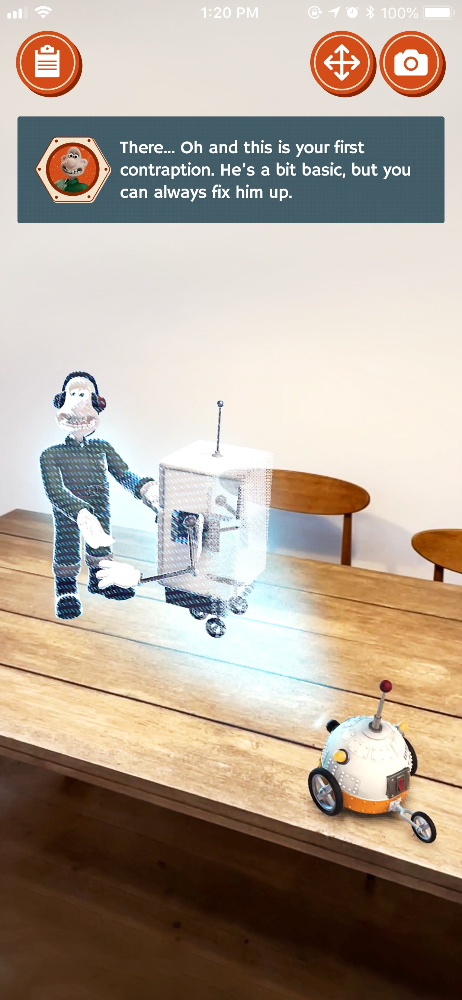
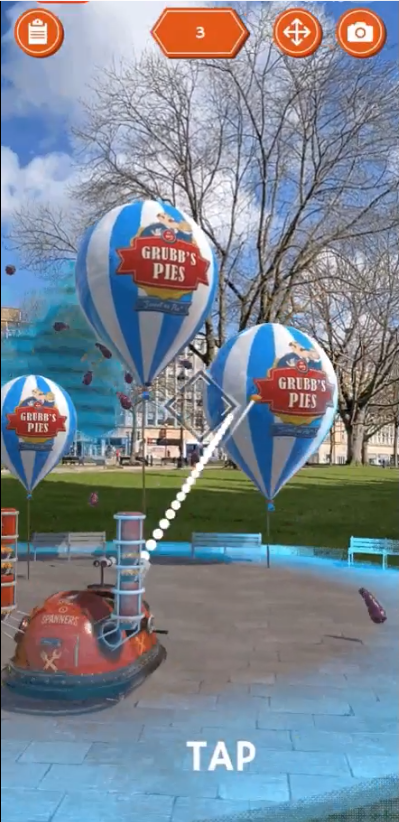

+++
date = '2021-01-26T20:38:22+09:00'
draft = false
title = 'The Big Fix Up'
company = 'Created in collaboration with Aardman while working at Fictioneers'
subtitle = 'AR Interactive Story'
technology = 'Made in Unity, with AR Foundation'
bgColour = '#641E16 '
textColour = '#faf5e3'

+++


 I joined Fictioneers in early 2020 and worked as a Unity Dev for the final year of production of The Big Fix Up. As part of the Unity team I helped to build the augmented mini games that make up the main interactive part of the app.

As well as programming AR interactions I also created animations, shaders and other effects to help bring this app to life.

It was absolutely incredible to work with such a beloved IP, as I, like so many others, grew up watching Wallace and Gromit. 




























